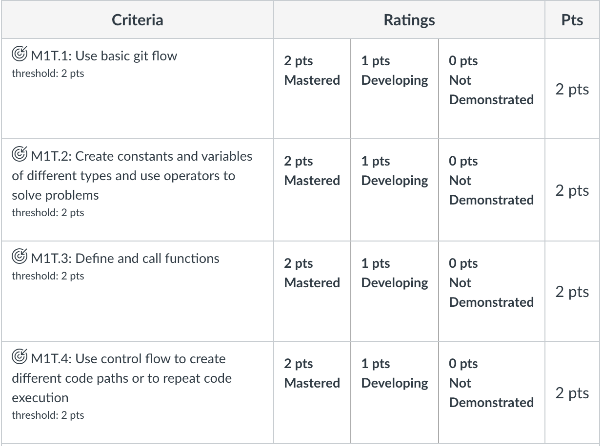
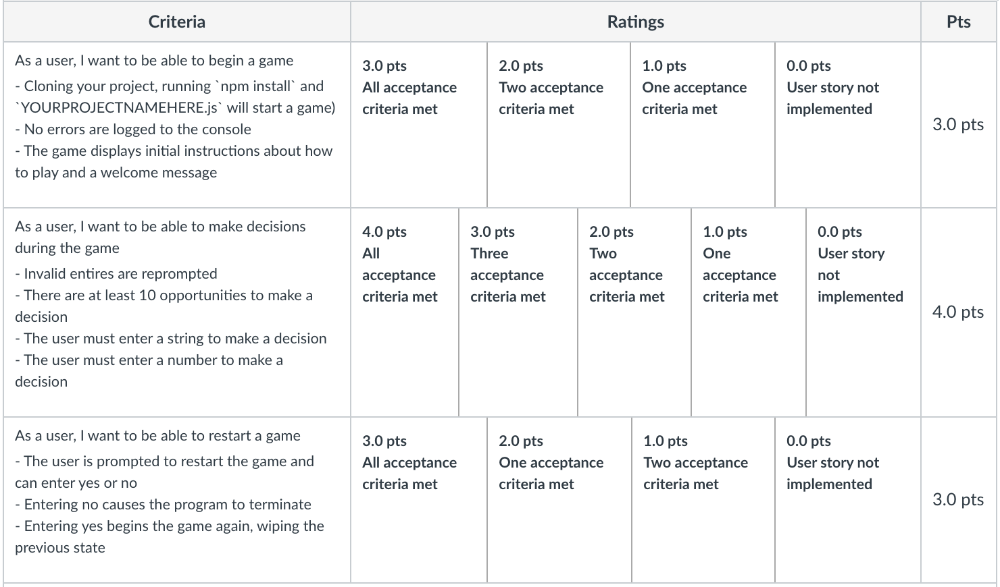

# Text-Based-Adventure

## Introduction

This project will build on the skills that you've learned after your first couple weeks of programming in JavaScript! You will build a command line application that plays a text-based adventure game.

### Examples

Look [here](https://classicreload.com/zork-i.html) and [here](http://www.bbc.co.uk/programmes/articles/1g84m0sXpnNCv84GpN2PLZG/the-hitchhikers-guide-to-the-galaxy-game-30th-anniversary-edition) for a couple examples of the genre.  Be creative!

A fun Google easter egg is to Google search `text adventure`. From the results page right click on the page and inspect the console. You should find a game by Google. 

### Reading input

This project imports an npm module called `readline-sync` that allows the user to enter input to the terminal. The line at the top: `const readline = require('readline-sync')` gives you access to this functionality

Use the following line to get user input:

```js
let yourVariableHere = readline.question("Enter your name: ")
```


## Setup Instructions

1. Fork this repo
1. Clone the forked repo to your machine
1. `cd` to the cloned folder and type `npm install` in the terminal.
1. Create a file called `.gitignore`.
1. Inside of .gitignore write `node_modules/`

## Submission Instructions

1. Complete the project
1. Commit and Push your changes to your fork
1. Submit a Pull Request back to the assignment repo
1. Paste a link to your Pull Request (not your fork!) on Canvas and submit


## User Stories

### As a user, I want to be able to begin a game

#### Acceptance criteria

- Cloning your project, running `npm install` and `node YOURPROJECTNAMEHERE.js` will start a game
- No errors are logged to the console
- The game displays initial instructions about how to play and a welcome message

### As a user, I want to be able to make decisions during the game

#### Acceptance criteria

- Invalid entires are re-prompted
- There are at least 10 opportunities to make a decision
- The user must enter a string to make a decision
- The user must enter a number to make a decision

### As a user, I want to be able to restart a game

#### Acceptance criteria

- The user is prompted to restart the game and can enter yes or no
- Entering no causes the program to terminate
- Entering yes begins the game again, wiping the previous state

## Trello Board

Replace the link below with the link to your Trello project:

[Trello](https://trello.com/b/vbKtMOKj/text-based-adventure-project-plan)


## Rubric



