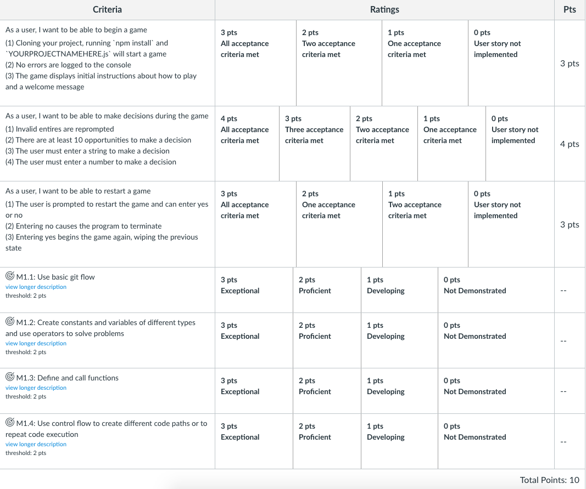

## Text-Based-Adventure

## Instructions for lab submission

1. Fork the assignment repo
1. Clone your Fork to your machine
1. Complete the lab
1. Push your changes to your Fork
1. Submit a Pull Request back to the assignment repo
1. Paste a link to your Pull Request (not your fork!) on Canvas and submit

## Lab

This lab will build on the skills that you've learned after your first couple weeks of programming in JavaScript!  You will build a command line application that plays a text-based adventure game.  Look [here](https://classicreload.com/zork-i.html) and [here](http://www.bbc.co.uk/programmes/articles/1g84m0sXpnNCv84GpN2PLZG/the-hitchhikers-guide-to-the-galaxy-game-30th-anniversary-edition) for a couple examples of the genre.  Be creative with your app. Apps will be evaluated by the following criteria:   

## App requirements:

<li>Your command line app must build and run with no compiler errors or warnings</li>
<li>Have at least 10 opportunities for the user to make decisions</li>
<li>Have at least one opportunity where the user will enter a number</li>
<li>Use both Switch statements and If/Else Statements</li>
<li>Use a for loop in your code</li>
<li>Use a while loop in your code</li>

 ## Rubric



## Hints:

- This project imports a special module called `readline-sync` that allows the user to enter input to the terminal

- The line at the top `const readline = require('readline-sync')` gives you access to this functionality

- Use the following line to get user input:

```js
let yourVariableHere = readline.question("Enter your name: ")
```
